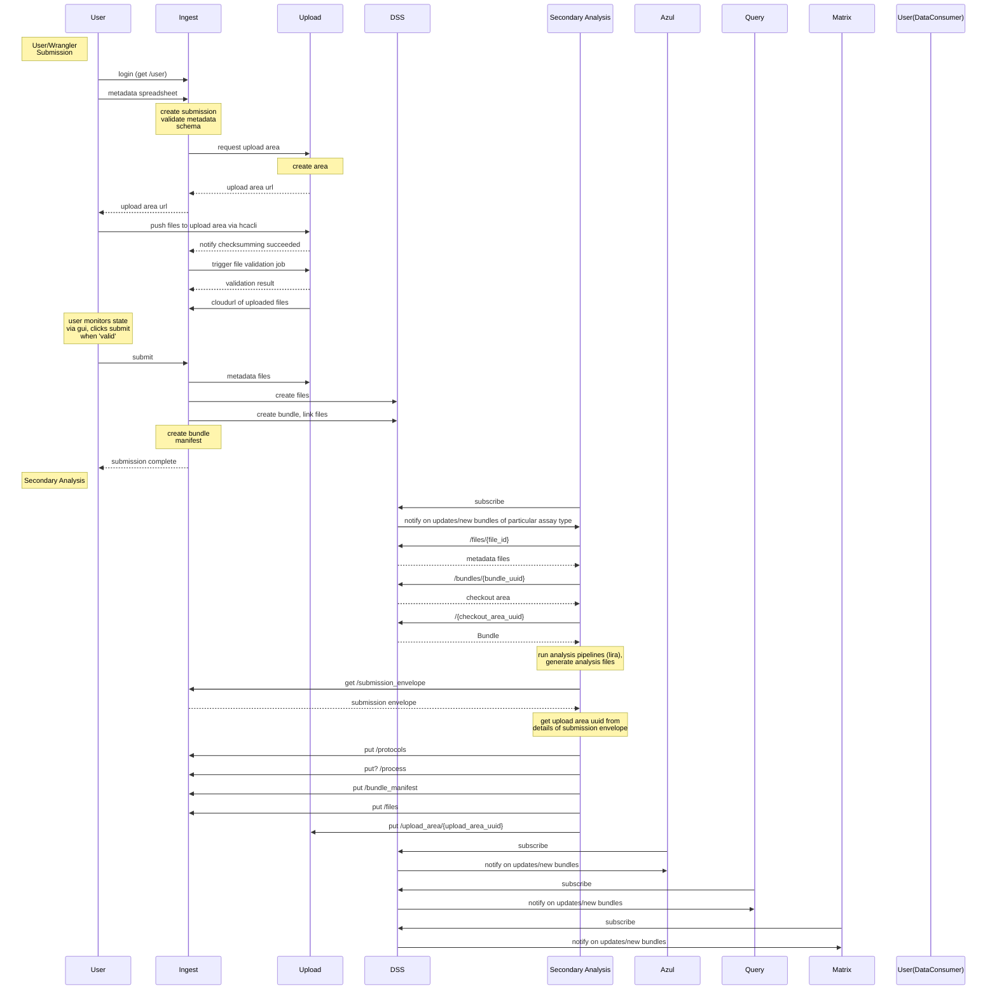

Submitting Data

```mermaid
sequenceDiagram
    participant User
    participant Ingest
    participant Upload
    participant DSS
    participant Secondary Analysis
    participant Azul
    participant Query
    participant Matrix
    participant User(DataConsumer)

    Note left of User: User/Wrangler<br> Submission
    User->>Ingest: login (get /user)
    User->>Ingest: metadata spreadsheet
    Note over Ingest: create submission<br>validate metadata<br>schema 
    
    Ingest->>Upload: request upload area
    Note over Upload: create area

    Upload-->>Ingest: upload area url
    Ingest-->>User: upload area url

    User->>Upload: push files to upload area via hcacli
    Upload-->>Ingest: notify checksumming succeeded
    Ingest->>Upload: trigger file validation job
    Upload-->>Ingest: validation result
    
    Upload->>Ingest: cloudurl of uploaded files
   
    Note over User: user monitors state <br>via gui, clicks submit <br>when 'valid'
    User->>Ingest: submit
    Ingest->>Upload: metadata files
    Ingest->>DSS: create files
    Ingest->>DSS: create bundle, link files
    Note over Ingest: create bundle <br>manifest
    Ingest-->>User: submission complete
    
    Note left of User: Secondary Analysis
    Secondary Analysis->>DSS: subscribe
    DSS->>Secondary Analysis: notify on updates/new bundles of particular assay type
    Secondary Analysis->>DSS: /files/{file_id}
    DSS-->>Secondary Analysis: metadata files
    Secondary Analysis->>DSS: /bundles/{bundle_uuid}
    DSS-->>Secondary Analysis: checkout area
    Secondary Analysis->>DSS: /{checkout_area_uuid}
    DSS-->>Secondary Analysis: Bundle
    
    Note over Secondary Analysis: run analysis pipelines (lira), <br>generate analysis files
    Secondary Analysis->>Ingest: get /submission_envelope
    Ingest-->>Secondary Analysis: submission envelope
    Note over Secondary Analysis: get upload area uuid from <br>details of submission envelope

    Secondary Analysis->>Ingest: put /protocols
    Secondary Analysis->>Ingest: put? /process
    Secondary Analysis->>Ingest: put /bundle_manifest
    Secondary Analysis->>Ingest: put /files
    Secondary Analysis->>Upload: put /upload_area/{upload_area_uuid}

    Azul->>DSS: subscribe
    DSS->>Azul: notify on updates/new bundles
    
    Query->>DSS: subscribe
    DSS->>Query: notify on updates/new bundles

    Matrix->>DSS: subscribe
    DSS->>Matrix: notify on updates/new bundles
    

```